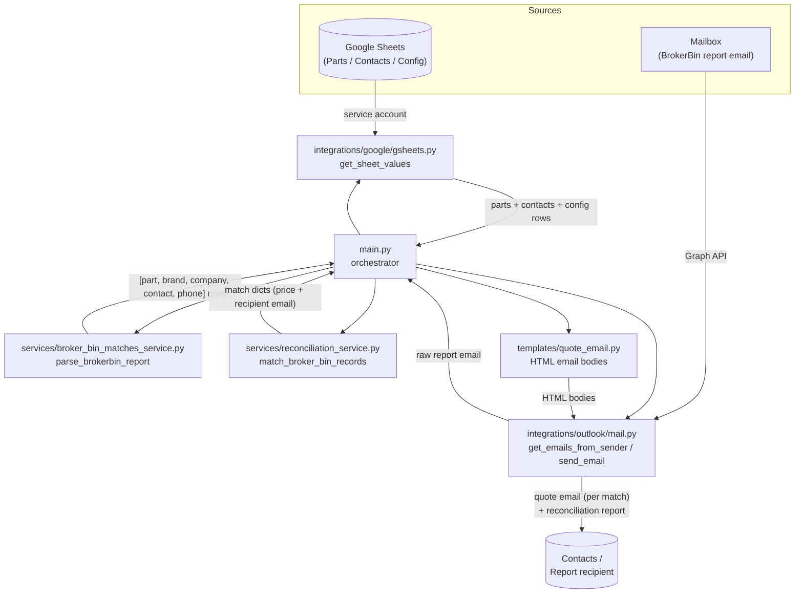

# Black Marlin Quote Automation Pipeline

An automation pipeline that watches for BrokerBin "Match Your Hits" report emails, matches each
part-search hit against a Google Sheet of parts/contacts, and automatically sends a quote email to
the matched contact — followed by a reconciliation report summarizing everything sent.

> This 2-week project was created in collaboration with, and under the guidance of,
> [@anhassan](https://github.com/anhassan).

## How it works

1. Fetches config, parts, and contacts data from Google Sheets (service-account auth).
2. Fetches the latest BrokerBin report email from a configured sender (Microsoft Graph).
3. Parses the report body into individual part-search hits.
4. Matches each hit against the parts/contacts sheet to resolve a price and a recipient email.
5. Sends one quote email per match, then a single reconciliation report email.



## Project structure

```
app/
├── main.py                              # Orchestrates the end-to-end run
├── requirements.txt
├── .env                                 # Local config/secrets (gitignored)
├── credentials/
│   └── service_account_key.json         # Google service-account key (gitignored)
├── integrations/
│   ├── google/
│   │   └── gsheets.py                   # get_sheet_values (service-account auth)
│   └── outlook/
│       └── mail.py                      # get_emails_from_sender, send_email (Graph app-only auth)
├── services/
│   ├── broker_bin_matches_service.py    # parse_brokerbin_report
│   └── reconciliation_service.py        # match_broker_bin_records, header mapping
└── templates/
    └── quote_email.py                   # HTML bodies for quote + reconciliation emails

.github/
└── workflows/
    └── quote-automation.yml             # Scheduled + manual CI run

.gitignore
README.md
```

## Setup

Install dependencies:

```
pip install -r app/requirements.txt
```

Configure `app/.env` with:

| Variable | Purpose |
|---|---|
| `GOOGLE_PARTS_SHEET_ID` / `GOOGLE_PARTS_SHEET_NAME` | Parts sheet location |
| `GOOGLE_CONTACTS_SHEET_ID` / `GOOGLE_CONTACTS_SHEET_NAME` | Contacts sheet location |
| `GOOGLE_CONFIG_SHEET_ID` / `GOOGLE_CONFIG_SHEET_NAME` | Config sheet location |
| `GOOGLE_SERVICE_ACCOUNT_FILE` | Path (relative to `app/`) to the Google service-account JSON key |
| `MS_TENANT_ID` / `MS_CLIENT_ID` / `MS_CLIENT_SECRET` | Azure app registration credentials for Microsoft Graph |
| `MS_SENDER_EMAIL` | Mailbox the app sends/reads mail as |
| `BROKER_BIN_REPORT_MINS` | How far back (minutes) to search for the BrokerBin report email |

Run:

```
python app/main.py
```

## Architecture notes

### Google Sheets auth (`app/integrations/google/gsheets.py`)

Uses a service-account JSON key rather than OAuth, since the pipeline runs unattended with no user
available to click through a login flow. The target spreadsheet must be explicitly shared
(Viewer/Editor) with the service account's `client_email` — access is controlled by sheet sharing,
not by GCP IAM roles on the service account itself. Full setup steps are documented in that file's
module docstring.

### Microsoft Graph auth (`app/integrations/outlook/mail.py`)

Uses app-only (client credentials) auth via an Azure app registration scoped to `Mail.Send` and
`Mail.Read`, with admin consent granted — not a personal user login. Full setup steps are
documented in that file's module docstring.

### Sheet header mapping (`app/services/reconciliation_service.py`)

`REQUIRED_HEADERS` maps lowercased Google Sheet column headers to internal field names
(`part_number`, `price`, `company_name`, `contact_name`, `primary_contact`, `secondary_contact`).
Contact resolution prefers `primary_contact` and falls back to `secondary_contact`; a company with
neither is skipped (no quote sent). Rows with an empty part number, empty price, or unmatched
company name are silently skipped.

### BrokerBin report parsing (`app/services/broker_bin_matches_service.py`)

Each "hit" spans three lines in the source report: an inventory line (authoritative part number +
brand), a "Searched by: \<company\>" line, and a contact name/phone line. The parser is
deliberately tolerant of HTML-to-text artifacts (missing spaces around "Searched by:", stray
`&nbsp;`, etc). `normalize_input` auto-detects the input shape (dict, list of dicts,
JSON/Python-literal string, raw HTML, or plain text) before parsing, since the upstream Graph API
payload shape can vary.

## CI / deployment

`.github/workflows/quote-automation.yml` runs the pipeline on a schedule (and via manual dispatch).
Secrets (`MS_TENANT_ID`, `MS_CLIENT_ID`, `MS_CLIENT_SECRET`, `GOOGLE_SERVICE_ACCOUNT_KEY_JSON`) are
injected via GitHub Actions secrets; the service-account JSON is written to
`app/credentials/service_account_key.json` before `main.py` runs. `app/.env` and
`app/credentials/*.json` are gitignored and must never be committed.
