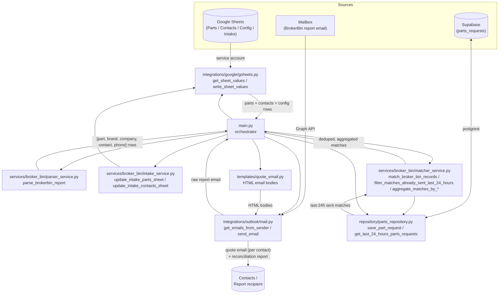

# Black Marlin Quote Automation Pipeline

An automation pipeline that watches for BrokerBin "Match Your Hits" report emails, matches each
part-search hit against a Google Sheet of parts/contacts, and automatically sends a quote email to
the matched contact — followed by a reconciliation report summarizing everything sent. Newly seen
parts and contacts are also synced into separate "intake" sheets, and every quote sent is persisted
to Supabase so the same hit isn't quoted twice within 24 hours.

> This 2-week project was created in collaboration with, and under the guidance of,
> [@anhassan](https://github.com/anhassan).

## How it works

1. Fetches config, parts, and contacts data from Google Sheets (service-account auth).
2. Fetches the latest BrokerBin report email matching the configured sender and subject (Microsoft Graph).
3. Parses the report body into individual part-search hits.
4. Syncs any part/company/contact not already recorded into the intake parts and contacts sheets.
5. Matches each hit against the parts/contacts sheet to resolve a price and a recipient email.
6. Filters out hits already quoted to the same contact within the last 24 hours (via Supabase).
7. Sends one aggregated quote email per contact (covering all their matched parts), then a single
   reconciliation report email with a per-company summary and the full detail table.
8. Persists every quote sent to Supabase, for future 24-hour dedup checks.



## Project structure

```
app/
├── main.py                                  # Orchestrates the end-to-end run
├── requirements.txt
├── .env                                     # Local config/secrets (gitignored)
├── credentials/
│   └── service_account_key.json             # Google service-account key (gitignored)
├── integrations/
│   ├── google/
│   │   └── gsheets.py                       # get_sheet_values / write_sheet_values (service-account auth)
│   └── outlook/
│       └── mail.py                          # get_emails_from_sender, send_email (Graph app-only auth)
├── services/
│   └── broker_bin/
│       ├── parser_service.py                # parse_brokerbin_report
│       ├── matcher_service.py               # match_broker_bin_records, aggregation, 24h dedup
│       └── intake_service.py                # syncs new parts/contacts into the intake sheets
├── repository/
│   ├── supabase_client.py                   # shared Supabase client
│   ├── parts_repository.py                  # save_part_request, get_last_24_hours_parts_requests
│   └── tables/sql/parts_requests.sql        # parts_requests table schema
└── templates/
    └── quote_email.py                       # HTML bodies for quote + reconciliation emails

.github/
└── workflows/
    └── quote-automation.yml                 # Scheduled + manual CI run

.gitignore
README.md
```

## Setup

Install dependencies:

```
pip install -r app/requirements.txt
```

Configure `app/.env` with:

| Variable | Purpose |
|---|---|
| `GOOGLE_PARTS_SHEET_ID` / `GOOGLE_PARTS_SHEET_NAME` | Parts sheet location |
| `GOOGLE_CONTACTS_SHEET_ID` / `GOOGLE_CONTACTS_SHEET_NAME` | Contacts sheet location |
| `GOOGLE_CONFIG_SHEET_ID` / `GOOGLE_CONFIG_SHEET_NAME` | Config sheet location |
| `GOOGLE_INTAKE_PARTS_SHEET_ID` / `GOOGLE_INTAKE_PARTS_SHEET_NAME` | Intake sheet that newly seen parts get appended to |
| `GOOGLE_INTAKE_CONTACTS_SHEET_ID` / `GOOGLE_INTAKE_CONTACTS_SHEET_NAME` | Intake sheet that newly seen companies/contacts get appended to |
| `GOOGLE_SERVICE_ACCOUNT_FILE` | Path (relative to `app/`) to the Google service-account JSON key |
| `MS_TENANT_ID` / `MS_CLIENT_ID` / `MS_CLIENT_SECRET` | Azure app registration credentials for Microsoft Graph |
| `MS_SENDER_EMAIL` | Mailbox the app sends/reads mail as |
| `BROKER_BIN_REPORT_MINS` | How far back (minutes) to search for the BrokerBin report email |
| `BROKER_BIN_REPORT_SUBJECT` | Subject text the BrokerBin report email must contain |
| `SUPABASE_URL` / `SUPABASE_KEY` | Supabase project used to persist sent quotes and dedup within 24 hours |

Run:

```
python app/main.py
```

## Architecture notes

### Google Sheets auth (`app/integrations/google/gsheets.py`)

Uses a service-account JSON key rather than OAuth, since the pipeline runs unattended with no user
available to click through a login flow. The target spreadsheets must be explicitly shared
(Viewer for read-only sheets, Editor for the intake sheets that get written to) with the service
account's `client_email` — access is controlled by sheet sharing, not by GCP IAM roles on the
service account itself. Full setup steps are documented in that file's module docstring.

### Microsoft Graph auth (`app/integrations/outlook/mail.py`)

Uses app-only (client credentials) auth via an Azure app registration scoped to `Mail.Send` and
`Mail.Read`, with admin consent granted — not a personal user login. The BrokerBin report is looked
up by sender address, received time window, and a `contains(subject, ...)` filter against
`BROKER_BIN_REPORT_SUBJECT`. Full setup steps are documented in that file's module docstring.

### Sheet header mapping (`app/services/broker_bin/matcher_service.py`)

`REQUIRED_HEADERS` maps lowercased Google Sheet column headers to internal field names
(`part_number`, `price`, `company_name`, `contact_name`, `primary_contact`, `secondary_contact`).
Contact resolution prefers `primary_contact` and falls back to `secondary_contact`; a company with
neither is skipped (no quote sent). Rows with an empty part number, empty price, or unmatched
company name are silently skipped.

### BrokerBin report parsing (`app/services/broker_bin/parser_service.py`)

Each "hit" spans three lines in the source report: an inventory line (authoritative part number +
brand), a "Searched by: \<company\>" line, and a contact name/phone line. The parser is
deliberately tolerant of HTML-to-text artifacts (missing spaces around "Searched by:", `<br>` tags
carrying attributes or missing a space before them, stray `&nbsp;`, etc). `normalize_input`
auto-detects the input shape (dict, list of dicts, JSON/Python-literal string, raw HTML, or plain
text) before parsing, since the upstream Graph API payload shape can vary.

### Intake sheet sync (`app/services/broker_bin/intake_service.py`)

Every run, newly seen `[part_number, brand_name]` and `[company_name, contact_name]` pairs from the
BrokerBin report are appended to separate intake sheets (with a blank third column left for manual
follow-up), so the team has visibility into parts/companies that aren't yet in the main
parts/contacts sheets. Existing and newly-collected rows are deduplicated before being written.

### 24-hour dedup and quote aggregation (`app/services/broker_bin/matcher_service.py`, `app/repository/`)

`filter_matches_already_sent_last_24_hours` checks each match against `parts_requests` rows
inserted by `repository/parts_repository.py` in the last 24 hours (by part number, brand, company,
contact, and recipient email) and drops anything already quoted. Surviving matches are then grouped
with `aggregate_matches_by_email` (so one contact with multiple part hits gets a single email
listing all of them) and `aggregate_matches_by_company` (used for the reconciliation report's
per-company summary table). If the Supabase lookup itself fails, all matches are treated as new
rather than silently dropping quotes.

## CI / deployment

`.github/workflows/quote-automation.yml` runs the pipeline on a schedule (and via manual dispatch).
Secrets — `MS_TENANT_ID`, `MS_CLIENT_ID`, `MS_CLIENT_SECRET`, `GOOGLE_SERVICE_ACCOUNT_KEY_JSON`, the
Google Sheet IDs/names (including the intake sheets), `BROKER_BIN_REPORT_MINS`/`_SUBJECT`, and
`SUPABASE_URL`/`SUPABASE_KEY` — are injected via GitHub Actions secrets; the service-account JSON is
written to `app/credentials/service_account_key.json` before `main.py` runs. `app/.env` and
`app/credentials/*.json` are gitignored and must never be committed.
